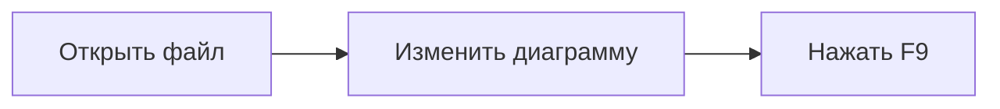

# reditor 🦀

Терминальный редактор кода на **Rust + Ratatui**, ориентированный на Rust. Интерфейс на русском, английском, немецком и испанском. Редактор включает rust-analyzer, нижний PTY-терминал, запуск приложений и задачи Cargo, Git, поиск с заменой, разделение окна и восстановление сессии.

## Запуск

Нужен Rust 1.90+ и обычный интерактивный терминал с UTF-8. Для JS/TS-плагинов нужен **Node.js 22.13+**; Lua 5.4 собирается вместе с редактором. Для просмотра Mermaid нужен локальный Node/Playwright-рендерер; инструкция ниже. На Unix для сборки Lua и Syntect необходим компилятор C (на macOS — Command Line Tools).

```sh
cd /Users/alexeyagafono/code/reditor
cargo run --release -- . --lang ru --plugins ./plugins
```

Открытие файлов во вкладках:

```sh
cargo run --release -- src/main.rs README.md --lang de
cargo run --release -- --workspace /path/to/project --lang es
```

Установка бинарного файла:

```sh
cargo install --path . --locked
reditor /path/to/project --lang en
```

Примеры плагинов подключаются **явно** через `--plugins ./plugins`. Аргумент можно повторять; он принимает как каталог с плагинами, так и каталог одного плагина. Исходники из открытого проекта автоматически не выполняются. Без Node.js редактор и Lua-плагины продолжают работать.

## Возможности

- Верхнее меню **File / Edit / Selection / View / Go / Run / Terminal / Help / Language** с действиями редактора и показом горячих клавиш. Меню открываются мышью; внутри работают стрелки, Enter и Esc. **File → Open Folder…** и `Ctrl+O` принимают путь к файлу или каталогу и переключают рабочий проект.
- Ctrl+P ищет файлы проекта, Ctrl+Shift+P открывает палитру команд, Ctrl+Alt+P показывает недавние проекты. Открытые каталоги запоминаются в `~/.reditor/projects.json`.
- Локальная проверка орфографии и грамматики текста в `.txt` и прозы в `.md` на русском, английском, немецком и испанском с автоматическим определением языка. Ошибки подчёркиваются в редакторе, предложения доступны из списка. Установка: [docs/PROOFREADER.md](docs/PROOFREADER.md).

- Вкладки, проводник каталогов, номера строк, вертикальная и горизонтальная прокрутка.
- Подсветка исходников Markdown, JavaScript/JSX, TypeScript/TSX, HTML, CSS и Rust через Syntect с расширенными грамматиками Two-Face.
- Файлы Rust-проектов: `build.rs`, `Cargo.toml`, `Cargo.lock`, `rust-toolchain.toml`, `rustfmt.toml`, `.cargo/config`, `.cargo/config.toml`, RON, JSON, YAML, `.gitignore` и другие текстовые конфигурации. Тип файла определяется по расширению, имени и первой строке; виден в строке состояния. Неизвестные UTF-8 форматы открываются как обычный текст.
- Управление мышью: клики по вкладкам, проводнику и нижней панели, установка курсора, выделение перетаскиванием, выбор слова двойным кликом, прокрутка документов и диалогов. Размеры проводника, разделённых областей и нижнего терминала меняются перетаскиванием границ ↔ / ↕.
- UTF-8, кириллица, emoji, широкие символы, сохранение LF/CRLF.
- Выделение клавишами Shift + перемещение, копирование, вырезание, вставка. При недоступном системном буфере используется внутренний буфер редактора.
- Создание файлов `.rs`, `.txt` и с другими расширениями; создание вложенных каталогов.
- Сохранение через временный файл с атомарной заменой, сохранение прав существующего файла и проверка внешних изменений. Перезапись другого файла требует подтверждения. Новый файл не затирает существующий.
- История отмены/повтора до 200 изменений на вкладку. Ropey хранит текст и снимки истории.
- Поиск с переходом к следующему совпадению и возвратом к началу файла.
- Автоотступ при Enter, форматирование буфера через `rustfmt`, фоновый `cargo check` и просмотр его вывода.
- Плагины Lua, JavaScript и TypeScript: команды, `on_open`, `before_save`, преобразование текста и сообщения.
- Переключение языков без перезапуска; выбор сохраняется в `.reditor/config.toml` рабочего каталога.
- Восстановление терминала при выходе, ошибке и панике; bracketed paste.

## Клавиши

| Клавиша | Действие |
| --- | --- |
| `Ctrl+S` | Сохранить текущий файл |
| `F4` / `Ctrl+Shift+S` | Сохранить как |
| `Ctrl+O` | Открыть файл по пути |
| `Ctrl+N` / `Ctrl+W` | Новая / закрыть вкладку |
| `F6` / `Ctrl+Tab` | Следующая вкладка |
| `Ctrl+E` | Переключить фокус проводника и редактора |
| `↑`, `↓`, `Enter`, `Backspace` в проводнике | Выбор, открытие, родительский каталог |
| `Ctrl+T` / `Ctrl+D` | Создать файл / каталог |
| `Ctrl+F` / `F3` | Поиск / следующее совпадение |
| `Shift` + стрелки, `Home`, `End`, `PageUp`, `PageDown` | Выделить текст |
| `Ctrl+A`, `Ctrl+C`, `Ctrl+X`, `Ctrl+V` | Выделить всё, копировать, вырезать, вставить |
| `Ctrl+Z` / `Ctrl+Y` | Отмена / повтор |
| `Ctrl+Home` / `Ctrl+End` | Начало / конец документа |
| `Ctrl+R` / `Alt+Shift+F` | Форматировать Rust через rustfmt / текущий файл через плагин |
| `Ctrl+B` / `F8` | Запустить cargo check / открыть вывод |
| `Ctrl+P` / `Ctrl+Shift+P` | Быстрый поиск файлов / палитра команд и плагинов |
| `F5` | Перезагрузить плагины и проводник |
| `F1` / `F2` | Справка / открыть меню выбора языка |
| `F7` | Переключить исходник и просмотр Markdown |
| `F9` | Просмотр Mermaid внутри редактора |
| `Ctrl+Q` | Выход с подтверждением при несохранённых изменениях |

Диалоги: `Enter` подтвердить, `Esc` отменить, `Ctrl+U` очистить ввод. Пути в диалогах разрешаются относительно текущего каталога проводника. `Ctrl+D` создаёт цепочку каталогов; при создании файла его родительский каталог уже должен существовать.

`F2` открывает меню **Русский / English / Deutsch / Español**. Текущий язык отмечен галочкой. Выберите язык стрелками и нажмите `Enter`, либо нажмите на нужную строку мышью. `Esc` закрывает меню без изменений. Выбор применяется сразу и сохраняется для следующего запуска.

Некоторые терминалы не различают `Ctrl+Shift+S` и `Ctrl+S`, либо перехватывают `Ctrl+Tab`. Используйте `F4` и `F6`. Вставка через сочетание клавиш самого терминала также поддерживается.

## PHP, Git и удалённые файлы — плагины на Lua

Встроенный установщик содержит плагины `php`, `git`, `remote` (FTP, SFTP и FTPS) и `formatter`. Их исходники находятся в [bundled](bundled); устанавливаются копии, которые можно редактировать.

```sh
./target/release/reditor --install-plugin php --install-plugin git --install-plugin remote --install-plugin formatter --scope user
```

Плагины пользователя загружаются из `~/.reditor/plugins`. Для установки только в текущий проект замените `--scope user` на `--scope project`. Настройки пользователя хранятся в `~/.reditor/config.toml`, подключения — в `~/.reditor/connections.toml`; проектные файлы в `.reditor` переопределяют отдельные поля. `REDITOR_USER_DIR` меняет общий каталог. Существующие плагины и настройки установщик не перезаписывает.

Команды доступны через **Ctrl+Shift+P** и **Ctrl+G**. **Ctrl+S** сохраняет открытый удалённый файл в локальный кэш и отправляет на сервер. Подробности и примеры: [docs/PLUGINS_REMOTE.md](docs/PLUGINS_REMOTE.md).

Слева находится панель значков плагинов: нажмите на значок, чтобы открыть команды плагина. Для `formatter` доступны форматирование файла, проверка с просмотром различий и включение форматирования при сохранении. Поддерживаемые форматы и установка Prettier/PHP CS Fixer: [docs/FORMATTER.md](docs/FORMATTER.md).

## Мышь

Новые возможности: **Ctrl+G** — палитра команд, **F10** — нижний терминал, **F11** — запуск Rust-приложения, **Ctrl+F11** — сборка. Полная инструкция: [терминал, Cargo, LSP, Git, окна и настройки](docs/WORKBENCH.md).

| Действие | Результат |
| --- | --- |
| Клик по вкладке | Переключиться на документ; активная вкладка остаётся видимой |
| Клик по файлу или каталогу | Выбрать элемент проводника |
| Двойной клик по файлу или каталогу | Открыть файл / перейти в каталог |
| Клик по `↑ ..` в проводнике | Перейти в родительский каталог |
| Клик по тексту | Установить курсор |
| Перетаскивание с левой кнопкой | Выделить текст, с прокруткой у границ панели |
| Shift + клик | Расширить выделение до точки клика |
| Двойной клик по тексту | Выделить слово |
| Клик по номеру строки | Выделить строку |
| Колесо | Прокрутить панель под указателем: документ, проводник, справку или вывод сборки |
| Shift + колесо / горизонтальное колесо | Горизонтальная прокрутка текста |
| Средняя кнопка в редакторе | Вставить из буфера обмена в текущую позицию курсора |
| Клик по действию в нижней панели | Сохранить, открыть файл, переключить проводник, открыть плагины/справку, сменить язык |
| Кнопки диалога / `×` | Подтвердить, отменить, закрыть |
| Двойной клик по команде плагина | Выполнить команду |

Мышь включается автоматически. Прокрутка колёсиком не меняет курсор и не возвращает экран к нему при перерисовке; клавиатурное редактирование снова показывает курсор. При выходе режим захвата мыши отключается. Для копирования в обход редактора многие терминалы позволяют зажать Shift и выделить текст средствами терминала; внутри редактора используйте выделение и `Ctrl+C`.

HTML отображается как редактируемый исходник с подсветкой. `Ctrl+R` форматирует Rust-файлы, а для остальных форматов сообщает, что rustfmt предназначен для Rust.

## Просмотр Markdown

Откройте `.md`, `.markdown` или `.mdown` и нажмите **F7**. Заголовки, жирный текст, курсив, зачёркивание, цитаты, вложенные и нумерованные списки, задачи с флажками, ссылки, таблицы и блоки кода отображаются прямо в терминале. Код внутри блоков подсвечивается. Ссылки показываются с адресами, изображения — с подписью и путём; внешние ресурсы не загружаются. Встроенный HTML показывается текстом.

Просмотр строится из текущего буфера, включая несохранённые изменения. Прямой ввод, вставка и обычные команды редактирования в режиме просмотра заблокированы. **F7** или кнопка на верхней границе панели возвращает исходник с прежним курсором. Режим и прокрутка сохраняются отдельно для каждой вкладки. Поиск `Ctrl+F` переключает в исходник.

Прокрутка: стрелки, `PageUp`/`PageDown`, `Home`/`End` и колесо мыши. Текст переносится по ширине панели, включая Unicode. HTML-предпросмотр и графические картинки Markdown в этом режиме не реализованы.

## Mermaid внутри редактора

**F9** открывает диаграмму в панели Ratatui. По умолчанию контуры и стрелки рисуются символами Unicode, а подписи — настоящим текстом терминала. Буквы остаются чёткими в обычных терминалах. Расположение элементов берётся из SVG Mermaid; это приближённое представление, без заливки, исходных шрифтов и декоративных стилей. Поддерживаются блоки `mermaid` внутри Markdown и самостоятельные `.mmd` / `.mermaid`. Рендерер использует Mermaid 11.17.2 и выполняется в фоне: он не открывает окно браузера. Диаграммы строятся локально без CDN и сетевых запросов.

Пример:

````markdown

````

Если диаграмм несколько, открывается блок у курсора или ближайший следующий. **[ / ]** или **Shift+Tab / Tab** переключают диаграммы, **+ / −** меняют масштаб, **0** сбрасывает масштаб и прокрутку, стрелки и колесо прокручивают. **Shift + колесо** прокручивает по горизонтали, **Ctrl + колесо** меняет масштаб. В текстовом режиме масштаб начинается со 100%: большие схемы прокручиваются, подписи не уменьшаются. **G** переключает текстовый и графический режимы. Кнопки панели работают мышью. **E** возвращает к исходному коду выбранного блока; после изменения нажмите **F9** для нового просмотра. **Esc** или повторный **F9** закрывает панель.

В дополнительном графическом режиме Kitty, iTerm2 и Sixel выводят настоящее изображение, если терминал сообщает о поддержке протокола. Остальные терминалы используют цветные символы-полублоки, в которых мелкий текст теряет читаемость; **G** возвращает чёткие текстовые подписи. Протокол изображения можно принудительно выбрать через `REDITOR_IMAGE_PROTOCOL=halfblocks`. Ограничения рендеринга: 100 KB кода на диаграмму, до 16 млн пикселей, 200 тысяч точек контуров и 30 секунд на построение. Ошибка Mermaid показывается в панели; **E** позволяет исправить исходник.

На этой машине рендерер уже установлен. Для новой установки:

```sh
cd runtime/mermaid
npm ci
PLAYWRIGHT_BROWSERS_PATH="$PWD/.browsers" npx playwright install chromium
```

На Linux при отсутствии библиотек Chromium используйте `playwright install --with-deps chromium`. В PowerShell перед установкой задайте `$env:PLAYWRIGHT_BROWSERS_PATH="$PWD/.browsers"`.

Готовый Mermaid JS-bundle хранится в `assets/mermaid.min.js`, пересборка — `npm run build`. Если каталог проекта перемещён после сборки или бинарник установлен отдельно, задайте `REDITOR_MERMAID_RUNTIME=/полный/путь/runtime/mermaid`; рядом должен быть каталог `../../assets`. Можно использовать свой Chromium через `REDITOR_CHROMIUM=/путь/к/chromium`.

Проверка рендерера: `npm test` в `runtime/mermaid`. Полная проверка терминала: `python3 scripts/smoke_tui.py target/release/reditor --mermaid` из корня проекта. Пример для знакомства: [examples/preview.md](examples/preview.md).

## Плагины

API, примеры и ограничения описаны в [plugins/README.md](plugins/README.md). TypeScript поддерживает аннотации типов и интерфейсы без отдельной сборки. Для конструкций, требующих генерации JavaScript (`enum`, namespaces), и внешних зависимостей сначала соберите плагин в один `.js` файл.

Подключайте доверенные плагины: контекст Node `vm` **не является границей безопасности**. Время JS/Lua обработчика ограничено; ошибка обработчика не завершает редактор. Ошибка `before_save` отменяет сохранение. Обработчики каждого события запускаются в свежем контексте и не сохраняют состояние между вызовами.

## Проверка и структура

```sh
cargo fmt --check
cargo clippy --all-targets --locked -- -D warnings
cargo test --locked
cargo build --release --locked
python3 scripts/smoke_tui.py target/release/reditor # macOS / Linux
```

Тесты JS/TS требуют Node.js, в CI он установлен явно.

| Модуль | Назначение |
| --- | --- |
| `src/document.rs` | Текст, курсор, выделение, история, сохранение |
| `src/app.rs` | Команды редактора, вкладки, диалоги, запуск Rust-инструментов |
| `src/ui.rs` | Ratatui, подсветка, прокрутка, отображение диалогов |
| `src/i18n.rs`, `locales/*.json` | Переводы и переключение языка |
| `src/filetype.rs`, `syntaxes/` | Распознавание файлов и расширенные грамматики |
| `src/mouse.rs` | Клики, выделение, прокрутка и действия мыши |
| `src/markdown.rs` | CommonMark/GFM, стили, таблицы, переносы и просмотр |
| `src/diagram.rs`, `runtime/mermaid/` | Mermaid, фоновый рендеринг и работа с исходниками диаграмм |
| `src/plugins.rs`, `runtime/runner.mjs` | Загрузка манифестов и исполнение Lua/JS/TS |
| `src/process.rs` | Процессы с таймаутом и ограниченным выводом |

В этой версии открываются текстовые UTF-8 файлы до 16 MiB. Внешние инструменты и плагины возвращают не более 2 MiB вывода на поток; превышение размера ответа плагина приводит к ошибке разбора, без применения текста. `rustfmt` запускается с edition 2024. `cargo check` проверяет сохранённые файлы ближайшего Cargo-проекта; редактор не сохраняет вкладки автоматически. Сообщения ОС, Rust-инструментов и авторские названия команд плагинов остаются на языке источника.

Встроенный отладчик и бинарные кодировки файлов не реализованы. PTY и сценарии запуска проверены на macOS; CI также собирает проект для Linux и Windows.

Реализованные пункты и ограничения: [ROADMAP.md](ROADMAP.md).

Использованные API: [Ratatui](https://ratatui.rs/installation/), [mlua](https://docs.rs/mlua/0.11.6/mlua/), [Node.js TypeScript stripping](https://nodejs.org/api/module.html#modulestriptypescripttypescode-options).

Лицензия MIT.
