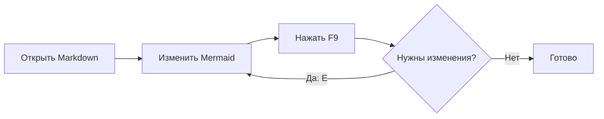
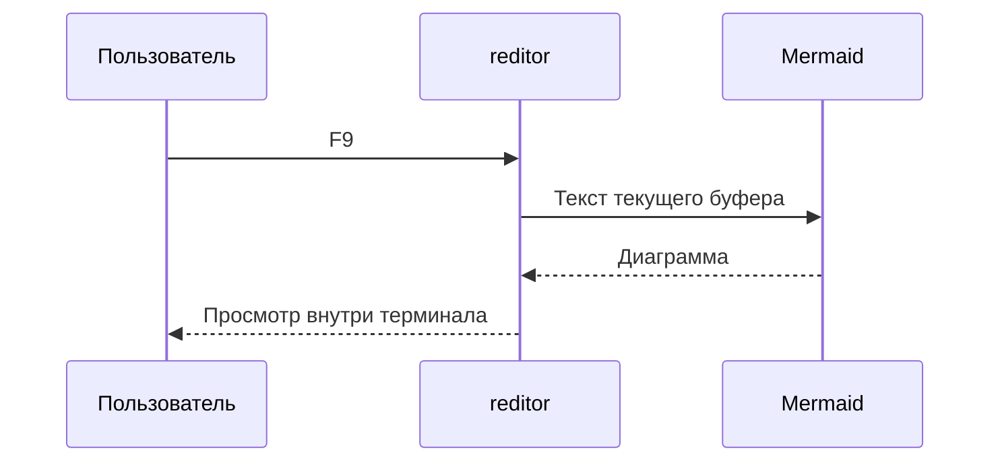
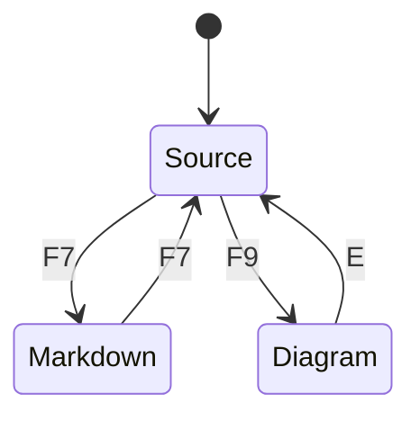

# reditor: Markdown и Mermaid 🦀

Нажмите **F7**, чтобы переключить исходник и просмотр Markdown.
Нажмите **F9**, чтобы открыть диаграмму внутри редактора.
В панели диаграммы: **+ / −** — масштаб, **стрелки** — перемещение,
**[ / ]** — следующая диаграмма, **E** — редактировать её исходник.

## Форматирование

Обычный текст, *курсив*, **жирный текст**, ~~зачёркнутый текст~~ и `inline code`.

> Просмотр использует текущий буфер: сохранять изменения для F7/F9 не требуется.

- [x] Заголовки и списки
- [x] Таблицы и блоки кода
- [x] Mermaid внутри Ratatui

| Режим | Клавиша |
| --- | --- |
| Markdown | F7 |
| Mermaid | F9 |
| Изменить диаграмму | E |

```rust
fn main() {
    println!("Привет, reditor!");
}
```

## Процесс редактирования



## Последовательность



## Состояния


